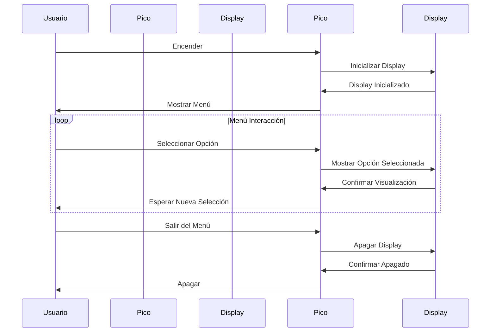
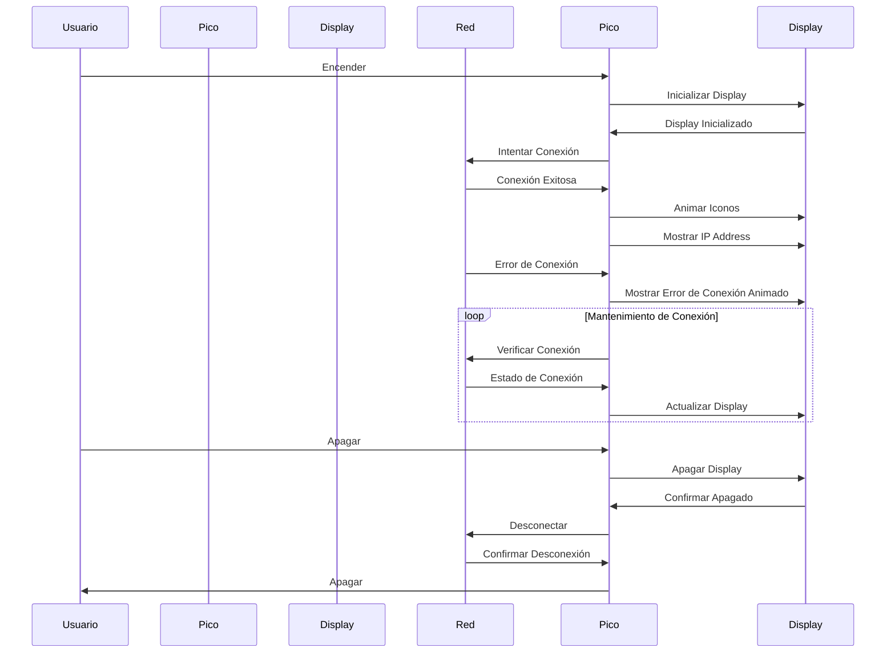

# 2.5 Embeded Web Server PicoW 

## Código Mermaid:

    sequenceDiagram
    
        participant Usuario
        participant RaspberryPiPico as Pico
        participant OLEDDisplay as Display
    
        Usuario->>Pico: Encender
        Pico->>Display: Inicializar Display
        Display->>Pico: Display Inicializado
        Pico->>Usuario: Mostrar Menú
        loop Menú Interacción
            Usuario->>Pico: Seleccionar Opción
            Pico->>Display: Mostrar Opción Seleccionada
            Display->>Pico: Confirmar Visualización
            Pico->>Usuario: Esperar Nueva Selección
        end
        Usuario->>Pico: Salir del Menú
        Pico->>Display: Apagar Display
        Display->>Pico: Confirmar Apagado
        Pico->>Usuario: Apagar

## Diagrama en Mermaid

## Código de PRACTICA en Mermaid 
    %% Diagrama de secuencia
    %% Adaptado de Rene Solis
    
    %% Por Oscar Sención
    
    %% PicoW es un WebServer y el OLED display aparece la IP, hay animacion diversa durante la corrida de su solución.
    %%
    sequenceDiagram
        participant Usuario
        participant RaspberryPiPico as Pico
        participant OLEDDisplay as Display
        participant Red
    
        Usuario->>Pico: Encender
        Pico->>Display: Inicializar Display
        Display->>Pico: Display Inicializado
        Pico->>Red: Intentar Conexión
        Red->>Pico: Conexión Exitosa
        Pico->>Display: Animar Iconos
        Pico->>Display: Mostrar IP Address
        Red->>Pico: Error de Conexión
        Pico->>Display: Mostrar Error de Conexión Animado
        loop Mantenimiento de Conexión
            Pico->>Red: Verificar Conexión
            Red->>Pico: Estado de Conexión
            Pico->>Display: Actualizar Display
        end
    %% En si el usuario puede no apagar la PicoW es  opcional
        Usuario->>Pico: Apagar
        Pico->>Display: Apagar Display
        Display->>Pico: Confirmar Apagado
        Pico->>Red: Desconectar
        Red->>Pico: Confirmar Desconexión
        Pico->>Usuario: Apagar

## Diagrama de práctica en Mermaid

## Visualización en el portal https://mermaid.live/:

