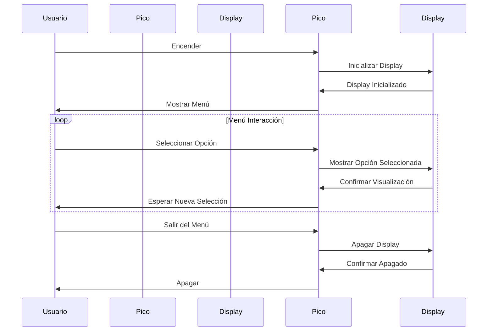
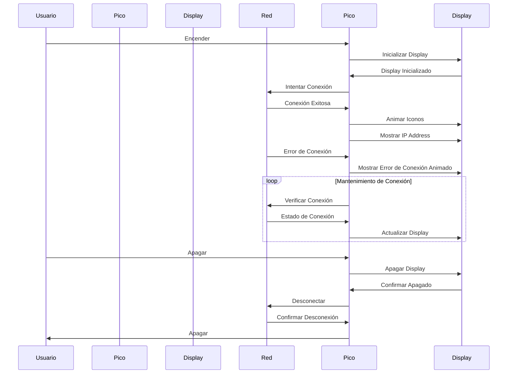

# 2.5 Embeded Web Server PicoW 

## Código Mermaid:

    sequenceDiagram
    
        participant Usuario
        participant RaspberryPiPico as Pico
        participant OLEDDisplay as Display
    
        Usuario->>Pico: Encender
        Pico->>Display: Inicializar Display
        Display->>Pico: Display Inicializado
        Pico->>Usuario: Mostrar Menú
        loop Menú Interacción
            Usuario->>Pico: Seleccionar Opción
            Pico->>Display: Mostrar Opción Seleccionada
            Display->>Pico: Confirmar Visualización
            Pico->>Usuario: Esperar Nueva Selección
        end
        Usuario->>Pico: Salir del Menú
        Pico->>Display: Apagar Display
        Display->>Pico: Confirmar Apagado
        Pico->>Usuario: Apagar


## Diagrama en Mermaid



## Código de PRACTICA en Mermaid 
    %% Diagrama de secuencia
    %% Adaptado de Rene Solis
    
    %% Por Oscar Sención
    
    %% PicoW es un WebServer y el OLED display aparece la IP, hay animacion diversa durante la corrida de su solución.
    %%
    sequenceDiagram
        participant Usuario
        participant RaspberryPiPico as Pico
        participant OLEDDisplay as Display
        participant Red
    
        Usuario->>Pico: Encender
        Pico->>Display: Inicializar Display
        Display->>Pico: Display Inicializado
        Pico->>Red: Intentar Conexión
        Red->>Pico: Conexión Exitosa
        Pico->>Display: Animar Iconos
        Pico->>Display: Mostrar IP Address
        Red->>Pico: Error de Conexión
        Pico->>Display: Mostrar Error de Conexión Animado
        loop Mantenimiento de Conexión
            Pico->>Red: Verificar Conexión
            Red->>Pico: Estado de Conexión
            Pico->>Display: Actualizar Display
        end
    %% En si el usuario puede no apagar la PicoW es  opcional
        Usuario->>Pico: Apagar
        Pico->>Display: Apagar Display
        Display->>Pico: Confirmar Apagado
        Pico->>Red: Desconectar
        Red->>Pico: Confirmar Desconexión
        Pico->>Usuario: Apagar


## Diagrama de práctica en Mermaid



## Visualización en el portal https://mermaid.live/:


## Código del programa para Raspberry
```python 
import machine
import network
import usocket as socket
from ssd1306 import SSD1306_I2C

# Configurar la pantalla OLED
i2c = machine.I2C(0, sda=machine.Pin(0), scl=machine.Pin(1), freq=400000)
oled = SSD1306_I2C(128, 64, i2c)

# Función para gestionar las solicitudes HTTP y cambiar el mensaje en la pantalla OLED
def handle_request(client_socket):
    request_data = client_socket.recv(1024)
    request_text = request_data.decode('utf-8')

    # Determinar el mensaje a mostrar en la pantalla OLED
    if 'GET /on' in request_text:
        message = "Encendido :)"
    elif 'GET /off' in request_text:
        message = "Apagado ._."
    else:
        message = "Solicitud no válida"

    # Limpiar la pantalla OLED
    oled.fill(0)
    oled.text("IP: " + wlan.ifconfig()[0], 0, 0, 1)  # Mostrar la IP en la pantalla OLED
    oled.text("Mensaje: " + message, 0, 20, 1)  # Mostrar el mensaje en la pantalla OLED
    oled.show()

    # Respuesta HTTP simple
    response = 'HTTP/1.1 200 OK\nContent-Type: text/html\n\n'
    response += '<h1>Control del mensaje en la pantalla OLED</h1>'
    response += '<p><a href="/on">Mostrar: Encender </a></p>'
    response += '<p><a href="/off">Mostrar: Apagar </a></p>'
    
    client_socket.send(response)
    client_socket.close()

# Configurar el servidor web
addr = socket.getaddrinfo('0.0.0.0', 80)[0][-1]
server_socket = socket.socket(socket.AF_INET, socket.SOCK_STREAM)
server_socket.bind(addr)
server_socket.listen(5)

print('Esperando conexiones en', addr)

# Conectar a la red Wi-Fi abierta "TecNM_ITT"
wlan = network.WLAN(network.STA_IF)
wlan.active(True)
wlan.connect('TecNM_ITT')

# Esperar hasta que la Raspberry Pi se haya conectado a la red Wi-Fi
while not wlan.isconnected():
    pass

# Imprimir la dirección IP en la consola
print('Dirección IP de la Raspberry Pi Pico W:', wlan.ifconfig()[0])

# Esperar y manejar las solicitudes entrantes
while True:
    client_socket, client_addr = server_socket.accept()
    print('Conexión desde', client_addr)
    handle_request(client_socket)
```

